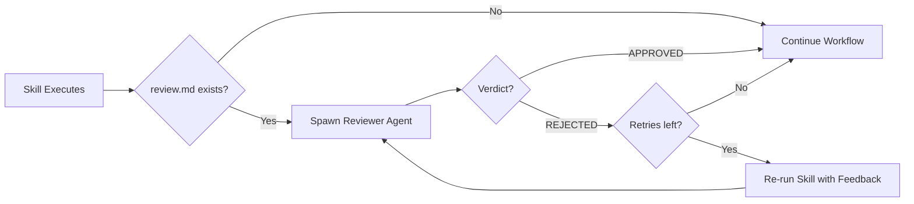

# Auto-Review

Auto-review is a quality gate that runs after skill execution. It spawns a reviewer agent to evaluate the skill's output and triggers retries with feedback when the result doesn't meet quality criteria.

## Overview

When a skill has a `review.md` file in its directory, Forge automatically invokes a reviewer agent after the skill completes. The reviewer evaluates the output according to instructions in `review.md` and issues a verdict:

- **APPROVED** — The output meets quality criteria; workflow continues
- **REJECTED** — The output has issues; skill re-runs with feedback injected



### When to Use Auto-Review

Auto-review is useful when:

- A skill produces artifacts that need quality validation before proceeding
- You want to catch common mistakes (missing tests, debug code, documentation gaps) without human intervention
- You need consistent quality standards across all executions of a skill

Auto-review is **not** a replacement for human code review — it catches machine-detectable issues early in the pipeline.

## Quick Start

Create a `review.md` file in your skill directory:

```
skills/
└── default/
    └── implement-task/
        ├── SKILL.md
        └── review.md      ← Reviewer configuration
```

Minimal `review.md`:

```markdown
---
max_retries: 3
---

# Quality Check

Verify the implementation:

1. All new public functions have tests
2. No debug print statements in committed code
3. Error handling uses specific exception types

Output APPROVED if all criteria pass, or REJECTED with specific feedback.
```

That's it. The next time `implement-task` runs, the reviewer will evaluate its output.

## Configuration

### `max_retries` in Frontmatter

The `max_retries` field in YAML frontmatter controls how many times a skill can retry after a REJECTED verdict:

```markdown
---
max_retries: 5
---

Review instructions here...
```

### `AUTO_REVIEW_MAX_RETRIES` Environment Variable

Set a global default for all skills that don't specify `max_retries` in their `review.md`:

```bash
# In .env or environment
AUTO_REVIEW_MAX_RETRIES=5
```

### Priority Chain

When determining retry limit, Forge checks in order:

| Priority | Source | Example |
|----------|--------|---------|
| 1 (highest) | Frontmatter `max_retries` | `max_retries: 5` in review.md |
| 2 | Environment variable | `AUTO_REVIEW_MAX_RETRIES=5` |
| 3 (lowest) | Built-in default | `3` |

### Default Value

If neither frontmatter nor environment variable is set, the default `max_retries` is **3**.

## Writing Review Instructions

The prose body of `review.md` (everything after the `---` closing delimiter) becomes the reviewer agent's instructions. Write clear, actionable criteria.

### Effective Review Instructions

**Do:**

- Define explicit pass/fail criteria for each quality dimension
- Include examples of acceptable vs. flagged patterns
- Specify the expected output format (APPROVED/REJECTED markers)
- Reference specific files or artifacts the reviewer should examine

**Don't:**

- Write vague instructions ("make sure the code is good")
- Include implementation details unrelated to review
- Duplicate instructions from the skill's SKILL.md

### Example: Comprehensive Review

```markdown
---
max_retries: 3
---

# Implementation Review

Review code changes via `git diff origin/main...HEAD`.

## Criteria

### Test Coverage
- Public functions must have tests
- Flag: new public function without corresponding test

### Error Handling
- No bare `except:` or empty `catch {}`
- Flag: generic error swallowing

### Documentation
- Public APIs need docstrings
- Flag: public function without documentation

## Verdict

Output exactly one:
- `APPROVED` — all criteria pass
- `REJECTED` — followed by specific, actionable feedback
```

See [skills/default/implement-task/review.md](https://github.com/your-org/forge/blob/main/skills/default/implement-task/review.md) for a complete example.

## Verdict Protocol

The reviewer must output exactly one verdict marker. Forge scans the output text for these markers.

### APPROVED

Use when all criteria pass:

```
APPROVED
```

Or with optional notes:

```
APPROVED

Notes:
- Consider adding edge case tests (non-blocking)
```

### REJECTED

Use when any criterion fails. Always include specific, actionable feedback:

```
REJECTED

Issues:
- [Test Coverage] src/handler.py:42 — `process_data()` is public but has no test
- [Error Handling] pkg/db.go:87 — error from `Query()` discarded with `_`

Required changes:
1. Add test for `process_data()` in `test_handler.py`
2. Handle or propagate error from `Query()` at line 87
```

### Verdict Detection

Forge performs case-insensitive substring matching for `APPROVED` and `REJECTED`:

- First marker found wins (if both appear, the one occurring first determines verdict)
- Marker can appear anywhere in the output (start, middle, end)
- Surrounding text is captured as feedback for REJECTED verdicts

### No Verdict Found

If neither marker appears, Forge treats the output as **REJECTED** with the feedback:

```
Verdict could not be parsed
```

This prevents silent failures from malformed reviewer output.

## Per-Project Overrides

Review configuration follows the same precedence rules as skill files. See [Authoring Skills](../skills/authoring.md) for the general pattern.

### Resolution Order

For a ticket `MYPROJECT-123` running skill `implement-task`:

| Priority | Path | Description |
|----------|------|-------------|
| 1 (highest) | `skills/myproject/implement-task/review.md` | Project override |
| 2 | `skills/default/implement-task/review.md` | Default configuration |

### Override Behavior

- If the project override exists, it **completely replaces** the default (no merging)
- If neither exists, the skill runs **without a reviewer**
- Project key is extracted from ticket key and lowercased (`MYPROJECT-123` → `myproject`)

### Example: Project-Specific Review

```
skills/
├── default/
│   └── implement-task/
│       └── review.md         ← Generic criteria for all projects
└── myproject/
    └── implement-task/
        └── review.md         ← Stricter criteria for myproject
```

The `myproject` override might add additional criteria:

```markdown
---
max_retries: 5
---

# MyProject Code Review

All default criteria plus:

## MyProject-Specific

### Performance
- No N+1 database queries
- Bulk operations must use batching

### Security
- All user input must be validated
- No raw SQL queries (use ORM)
```

## Observability

### Review Cycle Files

Each review cycle writes a JSON file to the workspace:

```
.forge/{step-name}/review_cycle_N.json
```

Where:
- `{step-name}` is the workflow step (e.g., `implement_task`, `local_review`)
- `N` is the cycle number (1-indexed)

**Example path:** `.forge/implement_task/review_cycle_1.json`

### File Contents

```json
{
  "cycle": 1,
  "max_cycles": 3,
  "verdict": "rejected",
  "feedback": "Missing tests for process_data() function",
  "skill": "implement-task",
  "elapsed_seconds": 12.5,
  "timestamp": "2024-01-15T10:30:00Z"
}
```

| Field | Type | Description |
|-------|------|-------------|
| `cycle` | int | Current cycle number (1-indexed) |
| `max_cycles` | int | Maximum allowed cycles |
| `verdict` | string | `"approved"` or `"rejected"` |
| `feedback` | string | Reviewer feedback text (empty for approved) |
| `skill` | string | Name of the skill being reviewed |
| `elapsed_seconds` | float | Time spent on this review cycle |
| `timestamp` | string | ISO 8601 UTC timestamp |

### Prometheus Metrics

Forge exposes these metrics at `/metrics`:

| Metric | Type | Labels | Description |
|--------|------|--------|-------------|
| `forge_review_cycles_total` | Counter | `skill`, `step` | Total review cycles detected |
| `forge_review_verdicts_total` | Counter | `skill`, `step`, `verdict` | Verdicts by outcome |
| `forge_review_duration_seconds` | Histogram | `skill`, `step` | Review cycle duration |

### Terminal Progress

In local/terminal mode, Forge prints progress during review loops:

```
Review cycle 1/3: REJECTED - Missing tests for process_data() function...
Review cycle 2/3: REJECTED - Tests added but error handling still missing...
Review cycle 3/3: APPROVED
```

Feedback is truncated to 200 characters in terminal output.

## Troubleshooting

### Reviewer Times Out

**Symptom:** Review cycle takes > 5 minutes and fails.

**Causes:**
- Reviewer instructions are too complex or ambiguous
- Large codebase with many files to examine
- Reviewer agent loops or gets stuck

**Solutions:**
- Simplify review criteria to focus on specific, checkable items
- Use `git diff` instead of reading entire files
- Add explicit instructions to limit scope

### Verdict Parsing Failures

**Symptom:** Every cycle shows "Verdict could not be parsed" even though reviewer output looks correct.

**Causes:**
- Marker is misspelled (`APROVED`, `REJECT`)
- Marker appears inside a code block (not detected)
- Non-ASCII characters in marker

**Solutions:**
- Ensure reviewer outputs exactly `APPROVED` or `REJECTED`
- Add explicit instructions: "Output the word APPROVED or REJECTED on its own line"
- Check reviewer output in cycle JSON files

### Endless Loops (Max Retries Hit)

**Symptom:** Skill always exhausts `max_retries` without passing.

**Causes:**
- Review criteria are impossible to satisfy automatically
- Feedback is not actionable by the skill
- Skill doesn't understand the feedback format

**Solutions:**
- Review the feedback in cycle JSON files — is it specific enough?
- Simplify criteria to things the skill can actually fix
- Increase `max_retries` if issues are intermittent
- Consider whether the criteria should cause rejection at all

### review.md Not Detected

**Symptom:** Skill runs without review even though `review.md` exists.

**Causes:**
- File is in wrong directory or has wrong name
- File is named `Review.md` (wrong case)
- Project override path is incorrect

**Solutions:**
- Verify exact path: `skills/{project}/{skill-name}/review.md`
- Check file is named `review.md` (lowercase)
- Verify project key extraction (`PROJ-123` → `proj`)

### YAML Frontmatter Errors

**Symptom:** `max_retries` setting is ignored.

**Causes:**
- Frontmatter is malformed YAML
- `max_retries` value is not an integer
- Missing `---` delimiters

**Solutions:**
- Validate YAML syntax
- Use integer value: `max_retries: 3` (not `"3"` or `three`)
- Ensure file starts with `---` on first line
- Check worker logs for "Malformed YAML" warnings

### Feedback Not Injected on Retry

**Symptom:** Skill re-runs but doesn't see previous feedback.

**Causes:**
- Conversation history file missing or corrupted
- Feedback format not recognized by skill

**Solutions:**
- Check `.forge/history/{task_key}.json` exists
- Verify "## Reviewer Feedback" section appears in retry prompt
- Review skill's handling of feedback sections

## Related Documentation

- [Authoring Skills](../skills/authoring.md) — General skill authoring guide
- [review.md Schema](../reference/review-md-schema.md) — Complete file format specification
- [Feature Workflow](feature-workflow.md) — How auto-review fits in the feature pipeline
- [Bug Workflow](bug-workflow.md) — How auto-review fits in the bug pipeline
