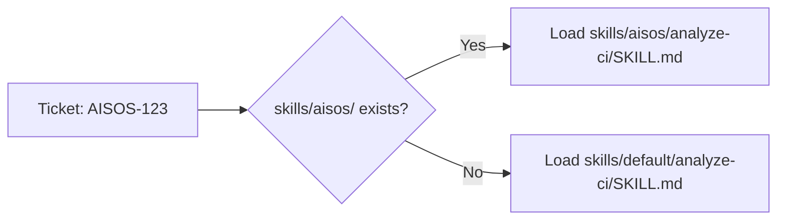

# Skills System

Skills are Markdown files that define what Forge's AI agents produce and how they reason. They are the primary customization mechanism for adapting Forge to your team's stack.

## How Skills Work

Each workflow stage — generating a PRD, analyzing a CI failure, implementing code — is driven by a skill. The skill defines:

- Output format and document structure
- Process steps and analysis frameworks
- Quality checklists and acceptance criteria
- Technology-specific conventions

Skills are loaded at runtime per ticket, resolved by Jira project key:



This means a team only needs to provide the skills they've customized. Everything else falls through to the defaults automatically.

## Directory Layout

```
skills/
├── default/              # Stack-agnostic defaults for all projects
│   ├── analyze-bug/
│   ├── analyze-ci/
│   ├── decompose-epics/
│   ├── fix-ci/
│   ├── generate-prd/
│   ├── generate-spec/
│   ├── generate-tasks/
│   ├── implement-review/
│   ├── implement-task/
│   ├── local-code-review/
│   └── review-code/
└── {project}/            # Per-project overrides (Jira key, lowercase)
    └── {skill-name}/
        └── SKILL.md
```

## Available Skills

| Skill | When It Runs |
|-------|-------------|
| `generate-prd` | PRD generation stage |
| `generate-spec` | Spec generation stage |
| `decompose-epics` | Epic decomposition stage |
| `generate-tasks` | Task generation stage |
| `implement-task` | Code implementation in container |
| `local-code-review` | Pre-PR diff review |
| `analyze-ci` | CI failure categorization |
| `fix-ci` | CI failure fix pass |
| `implement-review` | Post-PR-review fix pass |
| `review-code` | AI PR review against spec |
| `analyze-bug` | Bug RCA generation |

## The Primary Way to Contribute

Writing a skill set for your team's stack is the fastest way to make Forge work better for your project — and to share that knowledge with others using similar tooling.

See the [Authoring Guide](authoring.md) for how to write a skill, and [Default Skills](defaults.md) for what the defaults already provide.
